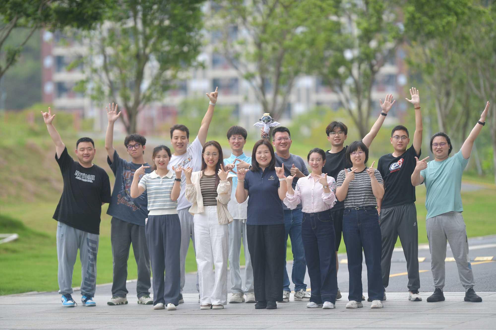

# We are Pan lab

  We are Pan lab from IBABI (Institute of Bio-Architecture and Bio-Interaction of 
  <a href="https://smart.org.cn/en/" target="_blank" rel="noopener">SMART</a>), 
  focusing on single particle Cryo-EM.

  

    

      

      
    

  

  

    
  



## About Our Research

Our lab specializes in **single-particle Cryo-EM** to determine high-resolution structures of membrane proteins, unraveling their working mechanisms and drug action principles. We combine structural biology with **biochemistry, physiology, and medicinal chemistry** to tackle key questions in disease biology.

**Research Directions:**

- Metabolic disease membrane proteins — structure-based drug discovery
- Tumor-immune related proteins — structural basis for immunotherapy



## Representative Publications











## Highlights



Our research









Meet the team!






